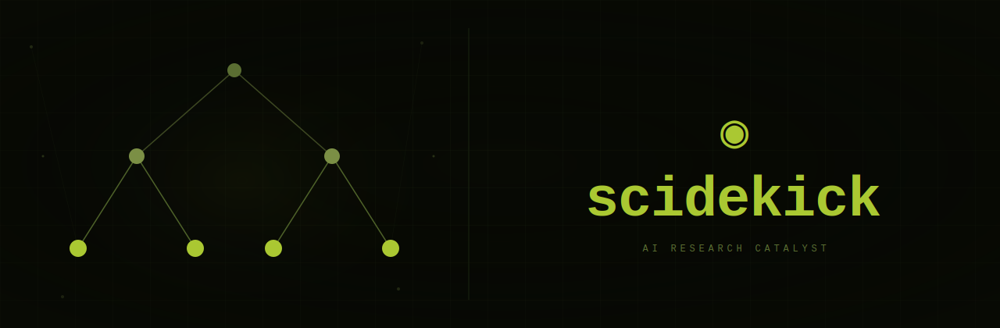

<p align="center">
  
</p>

<p align="center">
  <strong>Terminal-first AI coding and research assistant.</strong>
</p>

<p align="center">
  <a href="https://github.com/felippe-alves/scidekick/actions"></a>
  <a href="https://github.com/felippe-alves/scidekick/blob/main/LICENSE"></a>
  <a href="https://www.typescriptlang.org"></a>
  <a href="https://www.rust-lang.org"></a>
  <a href="https://bun.sh"></a>
</p>

Scidekick is a workspace-native agent for people doing serious coding and research. It reads and edits the repository you are in, uses language servers and debuggers, runs shell and eval workflows, searches the web, coordinates subagents, and keeps durable scientific notes under `.sk/`.

Scidekick is built from the mature Pi/Oh My Pi coding-agent lineage, but the product direction is Scidekick: `sk` as the CLI, `.sk` as the workspace/config root, and research-first surfaces for wiki, journal, scientific skills, model-tier guardrails, and reproducible AI/ML workflows.

## Current status

Implemented and wired into the CLI today:

- `sk` command identity and `.sk` project directories.
- Production coding-agent surface: read/search/edit/write, shell, eval, LSP, DAP debugger, browser automation, web search, subagents, memory, MCP, extensions, and model routing.
- Research wiki: `sk wiki init|new|page|ingest|list|show|query|lint`.
- Research journal: `sk journal init|add|today|link`.
- Scientific skills installer: `sk install-skills` / `sk skills`.
- Scientific prompt/theme defaults and model-tier warnings for scientific contexts.

Planned research orchestration surfaces such as `sk experiment`, `sk run`, `sk loop`, `sk pipeline`, and `sk team` are roadmap items, not product claims yet. Until those land, use the current wiki, journal, normal files, Python/JavaScript eval cells, shell commands, and the agent's existing tool surface to run research workflows.

## Install

### macOS and Linux

```sh
curl -fsSL https://raw.githubusercontent.com/felippe-alves/scidekick/main/scripts/install.sh | sh
```

### Windows PowerShell

```powershell
irm https://raw.githubusercontent.com/felippe-alves/scidekick/main/scripts/install.ps1 | iex
```

### From source

```sh
git clone https://github.com/felippe-alves/scidekick.git
cd scidekick
bun install
bun run install:dev
sk --version
```

Scidekick requires Bun `>= 1.3.14` for source installs. Release installers download `sk-*` binaries by default; pass `--source` to install from source.

## First run

Configure at least one model provider:

```sh
export ANTHROPIC_API_KEY=...
# or
export OPENAI_API_KEY=...
# or
export GEMINI_API_KEY=...
```

Start the TUI:

```sh
sk
```

Run a one-shot prompt:

```sh
sk -p "Explain this repository and identify the main entry points"
```

Use a specific model for one session:

```sh
sk --model opus
sk --model gpt-5.2
sk --smol haiku --slow opus --plan gemini-pro
```

Role-based routing lets Scidekick use different models for different work:

- `default` — normal turns.
- `smol` — lightweight background work and cheap subagent fan-out.
- `slow` — deeper reasoning.
- `plan` — architecture and planning.
- `commit` — commit messages and changelog work.

## Why Scidekick

### It is an agent with the IDE wired in

Scidekick uses the same kinds of signals a careful engineer uses: file structure, content search, AST search, type information, references, diagnostics, code actions, and debugger state. It does not guess at callsites when a language server can answer.

Core coding tools include:

- `read` — files, directories, archives, SQLite, PDFs, notebooks, images, URLs, and internal schemes through one path-shaped interface.
- `find` — glob-based path lookup with gitignore awareness.
- `search` — regex content search.
- `ast_grep` / `ast_edit` — structural queries and rewrites.
- `edit` — hash-anchored patches rejected when stale.
- `lsp` — definitions, references, diagnostics, code actions, renames, and raw LSP requests.
- `debug` — Debug Adapter Protocol sessions: launch, attach, breakpoints, stepping, variables, stack traces, and pause/evaluate on hung programs.

### It can actually run the work

The runtime includes persistent shell sessions, PTY support, background jobs, and persistent Python/JavaScript eval kernels. Eval cells can call back into the same tool surface, so a notebook-style analysis can read files, produce plots, and inspect repository state without leaving the session.

### It keeps research memory in the repo

Scidekick's research layer starts with files you can commit and diff:

```text
.sk/
  wiki/
  journal/
  skills/
```

Use the wiki for durable research knowledge:

```sh
sk wiki init
sk wiki new paper "Terminal-Bench 2.0"
sk wiki new hypothesis "Linear models are enough for Iris"
sk wiki new experiment "Iris baseline classification"
sk wiki query iris
sk wiki lint iris-baseline-classification
```

Use the journal for chronological decisions:

```sh
sk journal init
sk journal add "Started Iris baseline. Goal: compare a linear classifier and a tree model."
sk journal today
sk journal link 2026-05-31-140455 wiki:iris-baseline-classification
```

The goal is not a hidden chat memory. It is a durable research trail: what was tried, what changed, which result supports which claim, and what still needs verification.

### It treats scientific skills as operational artifacts

Install scientific skills from a repository:

```sh
sk install-skills --list --from felippe-alves/scientific-agent-skills
sk install-skills --from felippe-alves/scientific-agent-skills --skill literature-review
sk install-skills --project --from ./skills-repo
```

Skills are procedures the agent can load for a domain. Scidekick tracks this as a reliability problem, not just a prompt-library problem: unvalidated skills can cause negative transfer, so scientific workflows get model-tier warnings and the roadmap includes skill validation/evolution metadata.

### It is designed for evidence chains

The long-term product goal is that every meaningful research claim has a trace:

```text
claim → result → eval → run or rollout → config → code commit → dataset/taskset snapshot → model checkpoint or agent version → environment → trace → journal decision → wiki synthesis
```

For agentic systems, that expands to trajectories, tool calls, graders, judges, human approvals, policies, and sandbox state. The current wiki/journal slice is the foundation for that evidence chain.

## Main command surfaces

### Interactive TUI

```sh
sk
sk "Review the uncommitted changes for correctness and missing tests"
```

The TUI renders tool calls as cards, previews edits before they land, shows shell/eval output, and asks structured questions when user input is genuinely required.

### One-shot mode

```sh
sk -p "Summarize docs/scidekick-user-guide.md"
```

Useful for scripts, quick questions, and automation.

### Session resume and export

```sh
sk --continue "What did we decide last time?"
sk --resume
sk --resume <session-id-prefix>
sk --export ~/.sk/agent/sessions/<path>/session.jsonl
```

### ACP editor integration

```sh
sk acp
```

Scidekick speaks the Agent Client Protocol over JSON-RPC. Editors can route file writes, terminal output, and permission prompts through their own UI.

#### Zed

Zed has native external-agent support through ACP. Add Scidekick to Zed's `settings.json` under `agent_servers`:

```json
{
  "agent_servers": {
    "Scidekick": {
      "type": "custom",
      "command": "/absolute/path/to/sk",
      "args": ["acp"],
      "env": {
        "ANTHROPIC_API_KEY": "...",
        "OPENAI_API_KEY": "..."
      }
    }
  }
}
```

Use `command -v sk` to find the absolute path. If Zed is launched from Finder/Dock, pass provider keys in `env` because it may not inherit your shell environment. Then open Zed's agent panel, start a new external-agent thread, and choose **Scidekick**. Use **dev: open acp logs** from the command palette to inspect protocol traffic.

#### VS Code

VS Code does not currently ship a built-in ACP client. Install an ACP client extension such as [ACP Client](https://marketplace.visualstudio.com/items?itemName=formulahendry.acp-client), then add Scidekick to user or workspace settings:

```json
{
  "acp.agents": {
    "Scidekick": {
      "command": "/absolute/path/to/sk",
      "args": ["acp"],
      "env": {
        "ANTHROPIC_API_KEY": "...",
        "OPENAI_API_KEY": "..."
      }
    }
  }
}
```

Open the ACP Client panel, connect to **Scidekick**, and start a conversation. The extension's traffic log is useful for diagnosing startup, auth, or permission issues.

### RPC mode

```sh
sk --mode rpc --no-session
```

RPC mode exposes the agent over stdio using NDJSON frames for non-Node hosts or isolated embedding.

### Shell completions

```sh
# zsh
eval "$(sk completions zsh)"

# bash
eval "$(sk completions bash)"

# fish
sk completions fish > ~/.config/fish/completions/sk.fish
```

## Provider and model support

Scidekick supports direct APIs, gateways, coding-plan providers, and local OpenAI-compatible servers. Common providers include Anthropic, OpenAI, Google Gemini, xAI, Mistral, Groq, Cerebras, Fireworks, Together, Hugging Face, OpenRouter, Vercel AI Gateway, Cloudflare AI Gateway, Perplexity, Cursor, GitHub Copilot, Ollama, LM Studio, llama.cpp, vLLM, and LiteLLM.

Custom providers live in `~/.sk/agent/models.yml`. Role-specific fallback chains and path-scoped model roles let a project choose stronger models for risky work without changing global defaults.

See [docs/models.md](docs/models.md) and the [Scidekick User Guide](docs/scidekick-user-guide.md) for setup details.

## Web, browser, and MCP

Scidekick includes:

- `web_search` for cited web search across configured providers.
- URL-aware `read` for pages, GitHub issues/PRs, Stack Overflow, documentation, package registries, arXiv, PDFs, and JSON endpoints.
- `browser` for driving real Chromium tabs or CDP-attached apps.
- MCP server support for external tools, resources, prompts, scientific databases, lab systems, private APIs, and local knowledge bases.

## Repository layout

| Path | Purpose |
| --- | --- |
| `packages/coding-agent/` | Main `sk` CLI, TUI, SDK, command routing, tools, sessions, Scidekick command wiring |
| `packages/ai/` | Multi-provider LLM client and model/provider registry |
| `packages/agent/` | Agent runtime with tool calling and state management |
| `packages/tui/` | Terminal UI library with differential rendering |
| `packages/natives/` | Native bindings for text, search, shell, image, syntax, AST, and related operations |
| `packages/utils/` | Shared utilities for logging, dirs/env, streams, process helpers, and CLI primitives |
| `packages/scidekick-science/` | Scidekick science package |
| `packages/scidekick-guard/` | Model-tier guard helpers and skill registry support |
| `packages/scidekick-skills/` | Scientific skill installation support |
| `packages/stats/` | Local observability dashboard |
| `python/robomp/` | Python-side worker/orchestration experiments |
| `docs/` | User guide, science surface, architecture, tools, MCP, and implementation notes |
| `scripts/` | Installers, release/build tooling, session analysis, and repo utilities |

Some inherited package names still use the `@oh-my-pi/*` namespace while the Scidekick product identity and public CLI are `sk`. Keep that distinction in mind when reading source imports.

## Development

Install dependencies:

```sh
bun install
```

Run the development CLI:

```sh
bun run dev
```

Run checks:

```sh
bun run check
```

Run tests:

```sh
bun run test
```

Useful focused commands:

```sh
bun --cwd=packages/coding-agent run check
bun --cwd=packages/coding-agent run test
bun run build:site
```

For architecture and contribution details, see:

- [docs/scidekick-user-guide.md](docs/scidekick-user-guide.md)
- [docs/scidekick-architecture.md](docs/scidekick-architecture.md)
- [docs/scidekick-science-surface.md](docs/scidekick-science-surface.md)
- [packages/coding-agent/DEVELOPMENT.md](packages/coding-agent/DEVELOPMENT.md)

## Lineage

Scidekick is a direct fork in the Pi family: Mario Zechner's Pi established the original terminal agent foundation, Oh My Pi expanded it into a broad coding harness, and Scidekick focuses that foundation on coding plus scientific research workflows.

## License

MIT. See [LICENSE](LICENSE).

© 2025 Mario Zechner  
© 2025-2026 Can Bölük

- [GitHub](https://github.com/felippe-alves/scidekick)
- [User Guide](docs/scidekick-user-guide.md)
- [Science Surface](docs/scidekick-science-surface.md)
- [MIT License](LICENSE)
